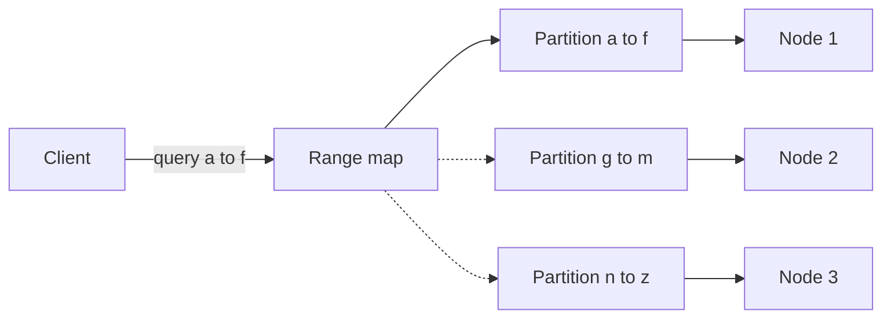

```mermaid
flowchart LR
    C["Client"] -->|"query a to f"| M["Range map"]
    M --> P1["Partition a to f"]
    M -.-> P2["Partition g to m"]
    M -.-> P3["Partition n to z"]
    P1 --> N1["Node 1"]
    P2 --> N2["Node 2"]
    P3 --> N3["Node 3"]
```
