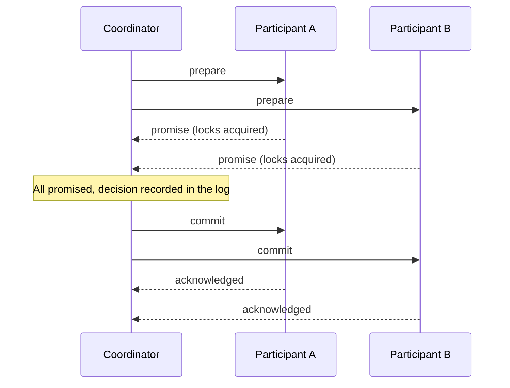

```mermaid
sequenceDiagram
    participant C as Coordinator
    participant A as Participant A
    participant B as Participant B
    C->>A: prepare
    C->>B: prepare
    A-->>C: promise (locks acquired)
    B-->>C: promise (locks acquired)
    Note over C: All promised, decision recorded in the log
    C->>A: commit
    C->>B: commit
    A-->>C: acknowledged
    B-->>C: acknowledged
```
