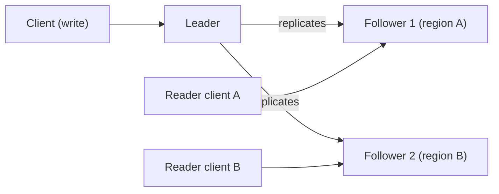

```mermaid
flowchart LR
    W["Client (write)"] --> L["Leader"]
    L -->|"replicates"| F1["Follower 1 (region A)"]
    L -->|"replicates"| F2["Follower 2 (region B)"]
    R1["Reader client A"] --> F1
    R2["Reader client B"] --> F2
```
