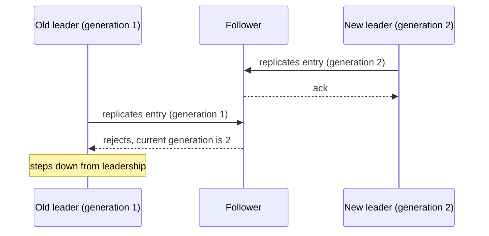

```mermaid
sequenceDiagram
    participant Old as Old leader (generation 1)
    participant F as Follower
    participant New as New leader (generation 2)
    New->>F: replicates entry (generation 2)
    F-->>New: ack
    Old->>F: replicates entry (generation 1)
    F-->>Old: rejects, current generation is 2
    Note over Old: steps down from leadership
```
