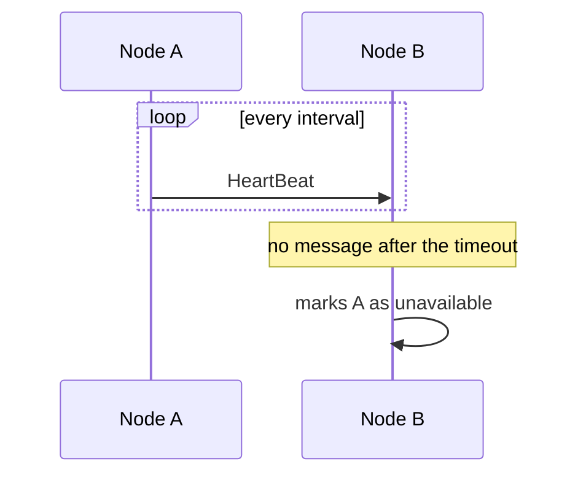

```mermaid
sequenceDiagram
    participant A as Node A
    participant B as Node B
    loop every interval
        A->>B: HeartBeat
    end
    Note over B: no message after the timeout
    B->>B: marks A as unavailable
```
