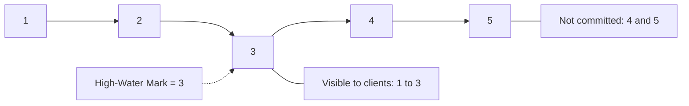

```mermaid
flowchart LR
    E1["1"] --> E2["2"] --> E3["3"] --> E4["4"] --> E5["5"]
    HW["High-Water Mark = 3"] -.-> E3
    E3 --- V["Visible to clients: 1 to 3"]
    E5 --- N["Not committed: 4 and 5"]
```
