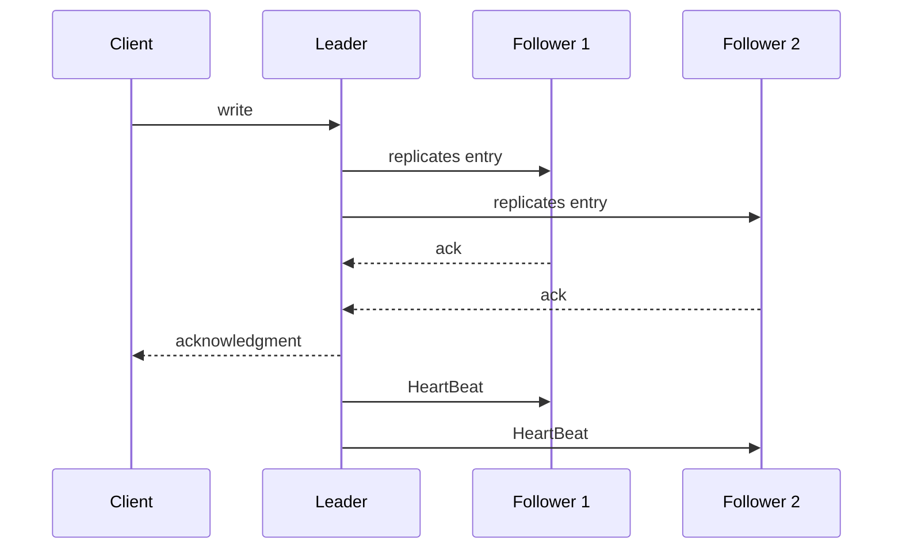

```mermaid
sequenceDiagram
    participant Cl as Client
    participant L as Leader
    participant F1 as Follower 1
    participant F2 as Follower 2
    Cl->>L: write
    L->>F1: replicates entry
    L->>F2: replicates entry
    F1-->>L: ack
    F2-->>L: ack
    L-->>Cl: acknowledgment
    L->>F1: HeartBeat
    L->>F2: HeartBeat
```
