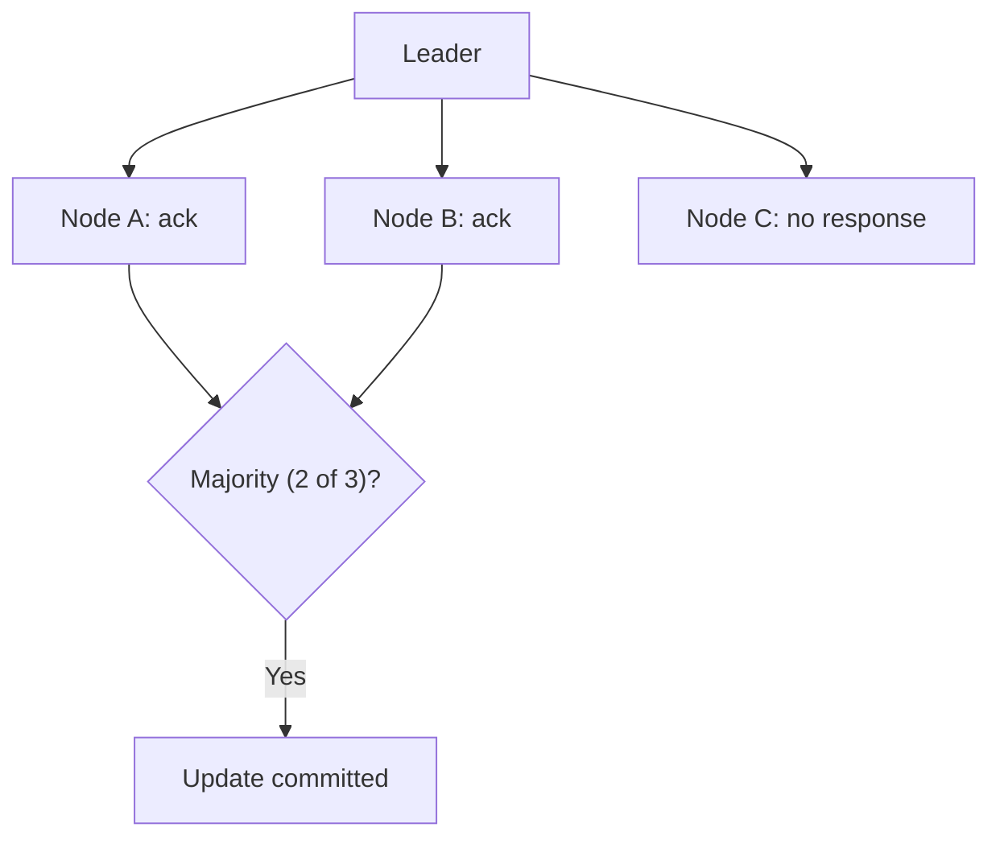

```mermaid
flowchart TB
    L["Leader"] --> A["Node A: ack"]
    L --> B["Node B: ack"]
    L --> C["Node C: no response"]
    A --> Q{"Majority (2 of 3)?"}
    B --> Q
    Q -->|"Yes"| OK["Update committed"]
```
