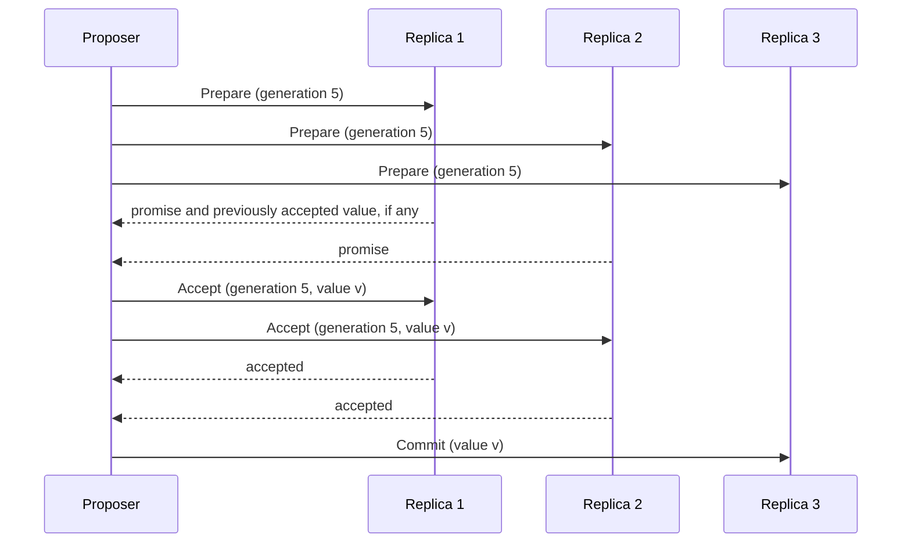

```mermaid
sequenceDiagram
    participant P as Proposer
    participant A1 as Replica 1
    participant A2 as Replica 2
    participant A3 as Replica 3
    P->>A1: Prepare (generation 5)
    P->>A2: Prepare (generation 5)
    P->>A3: Prepare (generation 5)
    A1-->>P: promise and previously accepted value, if any
    A2-->>P: promise
    P->>A1: Accept (generation 5, value v)
    P->>A2: Accept (generation 5, value v)
    A1-->>P: accepted
    A2-->>P: accepted
    P->>A3: Commit (value v)
```
