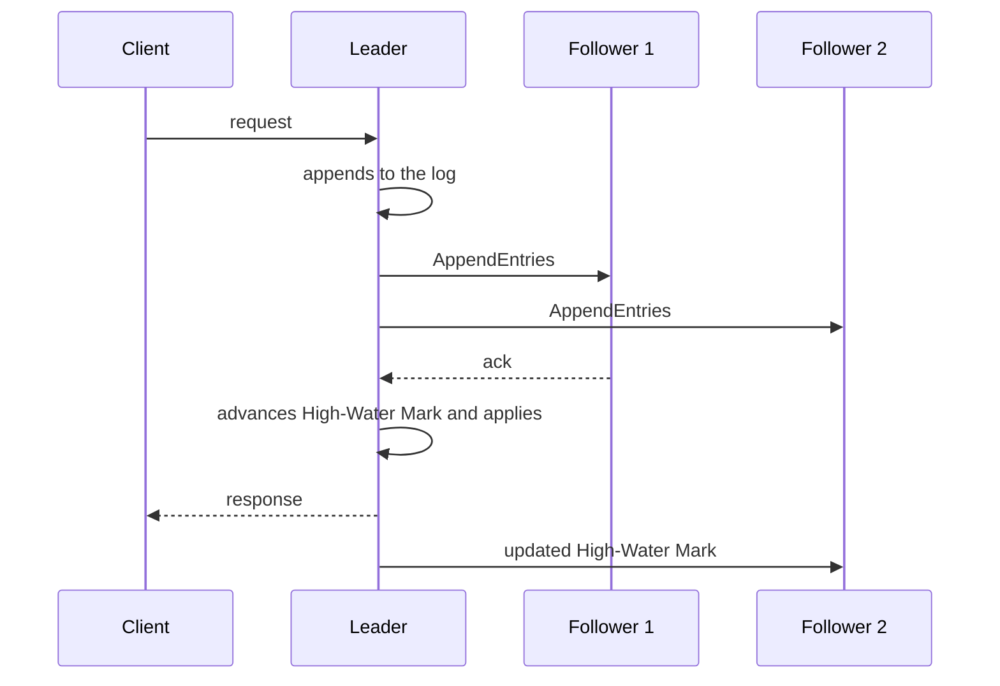

```mermaid
sequenceDiagram
    participant Cl as Client
    participant L as Leader
    participant F1 as Follower 1
    participant F2 as Follower 2
    Cl->>L: request
    L->>L: appends to the log
    L->>F1: AppendEntries
    L->>F2: AppendEntries
    F1-->>L: ack
    L->>L: advances High-Water Mark and applies
    L-->>Cl: response
    L->>F2: updated High-Water Mark
```
