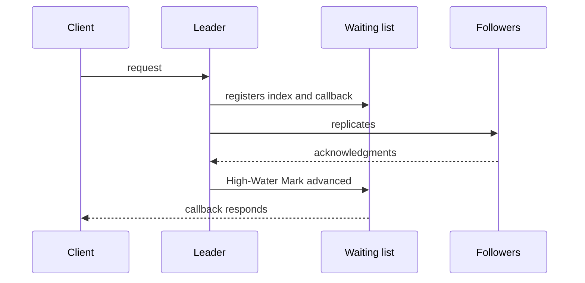

```mermaid
sequenceDiagram
    participant Cl as Client
    participant L as Leader
    participant W as Waiting list
    participant F as Followers
    Cl->>L: request
    L->>W: registers index and callback
    L->>F: replicates
    F-->>L: acknowledgments
    L->>W: High-Water Mark advanced
    W-->>Cl: callback responds
```
