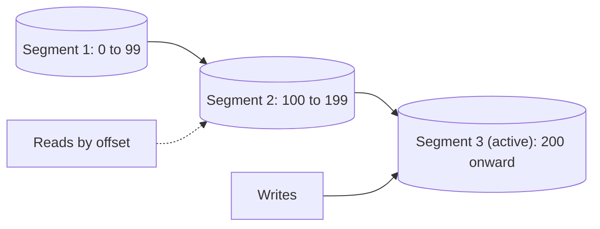

```mermaid
flowchart LR
    S1[("Segment 1: 0 to 99")] --> S2[("Segment 2: 100 to 199")]
    S2 --> S3[("Segment 3 (active): 200 onward")]
    W["Writes"] --> S3
    R["Reads by offset"] -.-> S2
```
