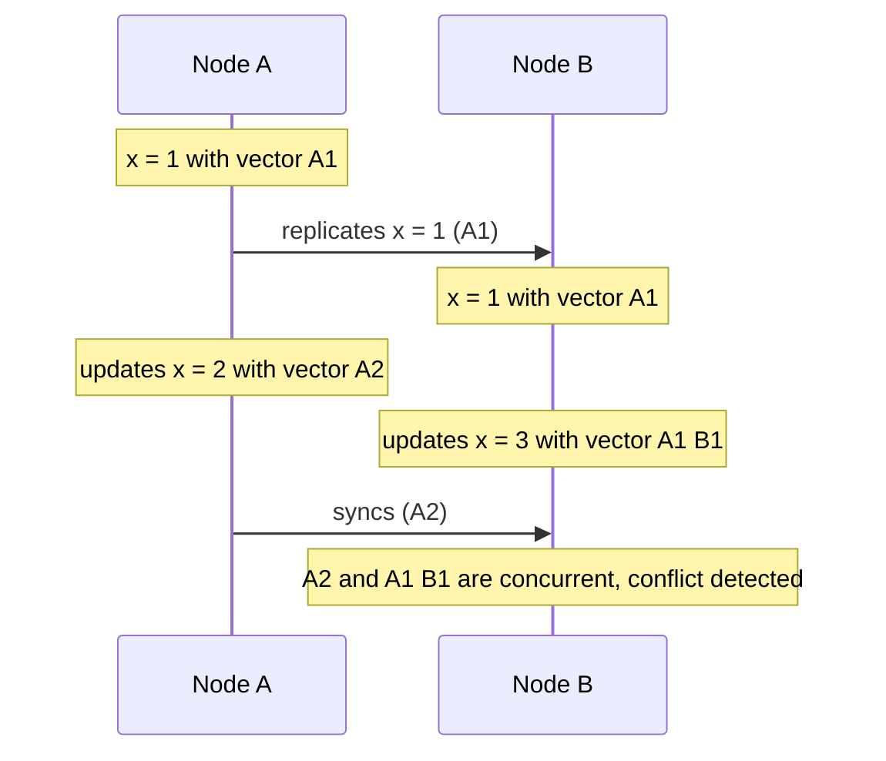

```mermaid
sequenceDiagram
    participant A as Node A
    participant B as Node B
    Note over A: x = 1 with vector A1
    A->>B: replicates x = 1 (A1)
    Note over B: x = 1 with vector A1
    Note over A: updates x = 2 with vector A2
    Note over B: updates x = 3 with vector A1 B1
    A->>B: syncs (A2)
    Note over B: A2 and A1 B1 are concurrent, conflict detected
```
