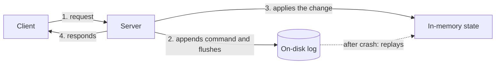

```mermaid
flowchart LR
    C["Client"] -->|"1. request"| S["Server"]
    S -->|"2. appends command and flushes"| L[("On-disk log")]
    S -->|"3. applies the change"| M["In-memory state"]
    S -->|"4. responds"| C
    L -.->|"after crash: replays"| M
```
