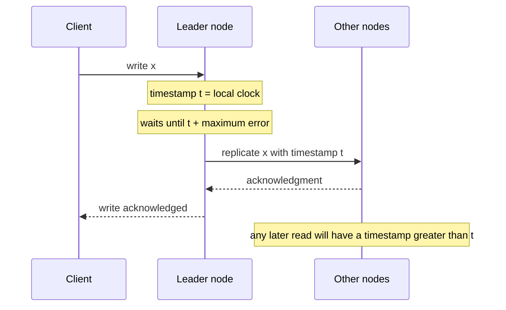

```mermaid
sequenceDiagram
    participant C as Client
    participant N as Leader node
    participant R as Other nodes
    C->>N: write x
    Note over N: timestamp t = local clock
    Note over N: waits until t + maximum error
    N->>R: replicate x with timestamp t
    R-->>N: acknowledgment
    N-->>C: write acknowledged
    Note over R: any later read will have a timestamp greater than t
```
