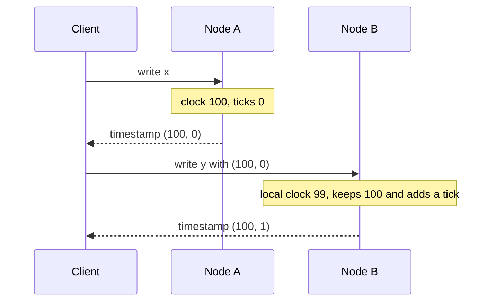

```mermaid
sequenceDiagram
    participant C as Client
    participant A as Node A
    participant B as Node B
    C->>A: write x
    Note over A: clock 100, ticks 0
    A-->>C: timestamp (100, 0)
    C->>B: write y with (100, 0)
    Note over B: local clock 99, keeps 100 and adds a tick
    B-->>C: timestamp (100, 1)
```
