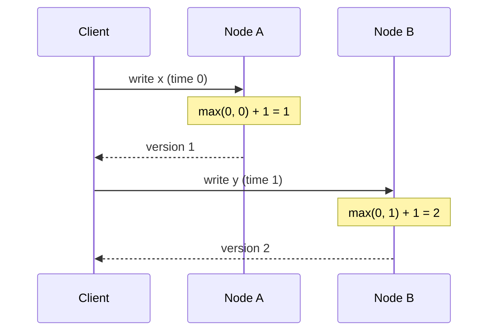

```mermaid
sequenceDiagram
    participant C as Client
    participant A as Node A
    participant B as Node B
    C->>A: write x (time 0)
    Note over A: max(0, 0) + 1 = 1
    A-->>C: version 1
    C->>B: write y (time 1)
    Note over B: max(0, 1) + 1 = 2
    B-->>C: version 2
```
