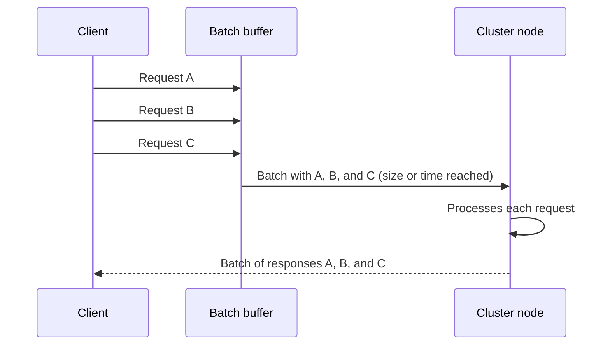

```mermaid
sequenceDiagram
    participant C as Client
    participant B as Batch buffer
    participant N as Cluster node
    C->>B: Request A
    C->>B: Request B
    C->>B: Request C
    B->>N: Batch with A, B, and C (size or time reached)
    N->>N: Processes each request
    N-->>C: Batch of responses A, B, and C
```
