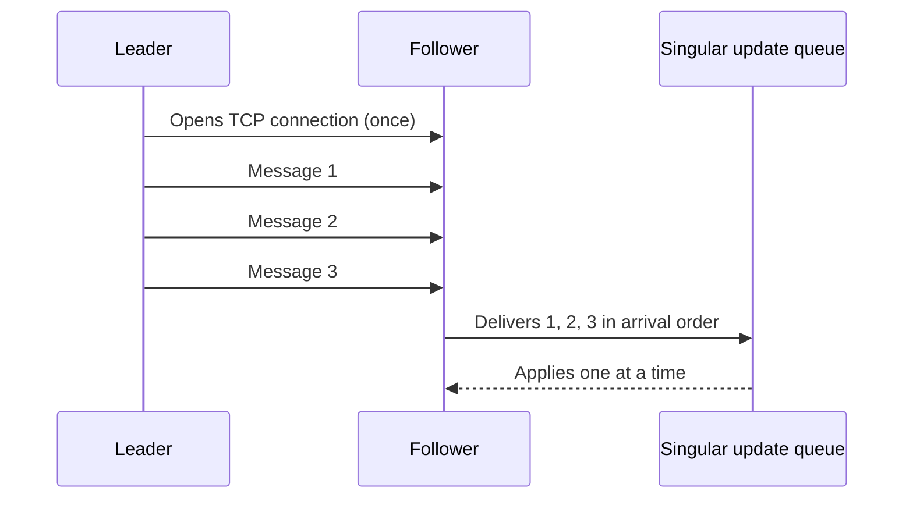

```mermaid
sequenceDiagram
    participant L as Leader
    participant F as Follower
    participant Q as Singular update queue
    L->>F: Opens TCP connection (once)
    L->>F: Message 1
    L->>F: Message 2
    L->>F: Message 3
    F->>Q: Delivers 1, 2, 3 in arrival order
    Q-->>F: Applies one at a time
```
