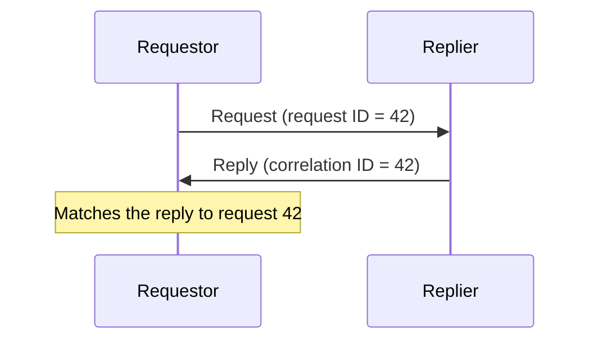

```mermaid
sequenceDiagram
    participant Req as Requestor
    participant Rep as Replier
    Req->>Rep: Request (request ID = 42)
    Rep->>Req: Reply (correlation ID = 42)
    Note over Req: Matches the reply to request 42
```
