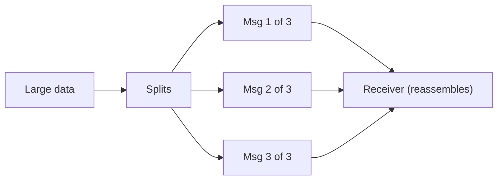

```mermaid
flowchart LR
    D["Large data"] --> S["Splits"]
    S --> M1["Msg 1 of 3"]
    S --> M2["Msg 2 of 3"]
    S --> M3["Msg 3 of 3"]
    M1 --> R["Receiver (reassembles)"]
    M2 --> R
    M3 --> R
```
