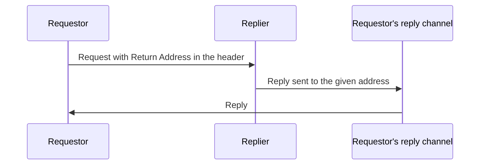

```mermaid
sequenceDiagram
    participant Req as Requestor
    participant Rep as Replier
    participant CRep as Requestor's reply channel
    Req->>Rep: Request with Return Address in the header
    Rep->>CRep: Reply sent to the given address
    CRep->>Req: Reply
```
