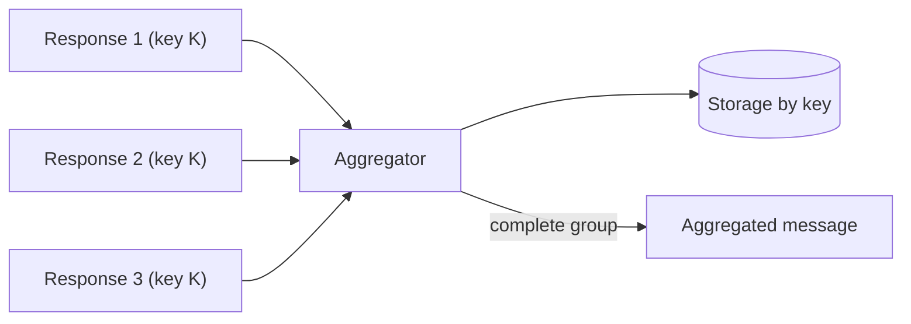

```mermaid
flowchart LR
    A["Response 1 (key K)"] --> AG["Aggregator"]
    B["Response 2 (key K)"] --> AG
    C["Response 3 (key K)"] --> AG
    AG --> S[("Storage by key")]
    AG -->|"complete group"| O["Aggregated message"]
```
