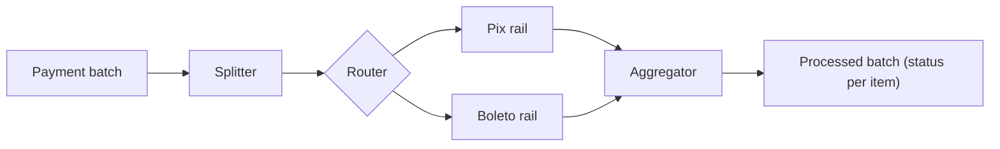

```mermaid
flowchart LR
    M["Payment batch"] --> S["Splitter"]
    S --> R{"Router"}
    R --> A["Pix rail"]
    R --> B["Boleto rail"]
    A --> AG["Aggregator"]
    B --> AG
    AG --> O["Processed batch (status per item)"]
```
