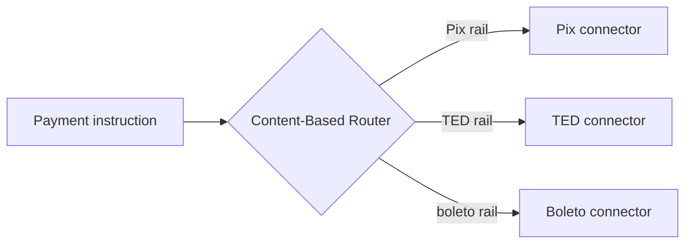

```mermaid
flowchart LR
    P["Payment instruction"] --> R{"Content-Based Router"}
    R -->|"Pix rail"| W["Pix connector"]
    R -->|"TED rail"| G["TED connector"]
    R -->|"boleto rail"| B["Boleto connector"]
```
