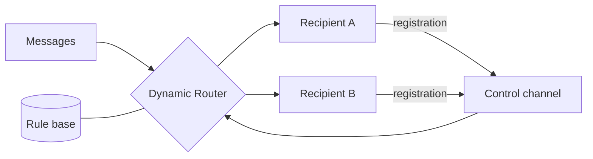

```mermaid
flowchart LR
    IN["Messages"] --> R{"Dynamic Router"}
    BR[("Rule base")] --- R
    A["Recipient A"] -->|"registration"| C["Control channel"]
    B["Recipient B"] -->|"registration"| C
    C --> R
    R --> A
    R --> B
```
