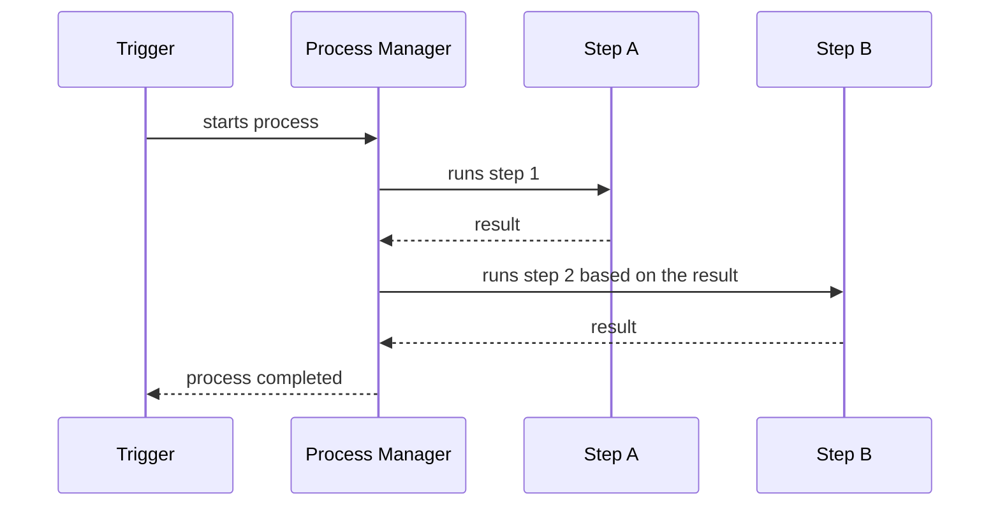

```mermaid
sequenceDiagram
    participant T as Trigger
    participant PM as Process Manager
    participant A as Step A
    participant B as Step B
    T->>PM: starts process
    PM->>A: runs step 1
    A-->>PM: result
    PM->>B: runs step 2 based on the result
    B-->>PM: result
    PM-->>T: process completed
```
