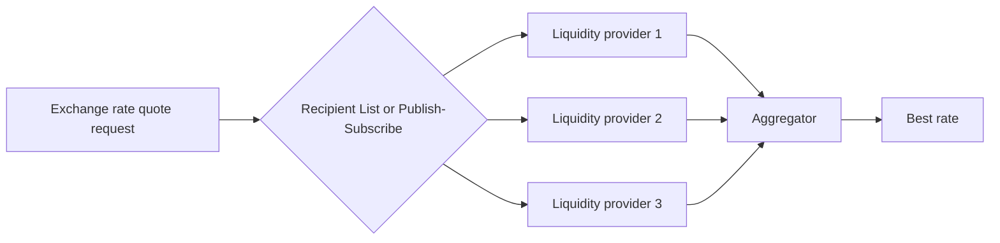

```mermaid
flowchart LR
    Q["Exchange rate quote request"] --> RL{"Recipient List or Publish-Subscribe"}
    RL --> F1["Liquidity provider 1"]
    RL --> F2["Liquidity provider 2"]
    RL --> F3["Liquidity provider 3"]
    F1 --> AG["Aggregator"]
    F2 --> AG
    F3 --> AG
    AG --> R["Best rate"]
```
