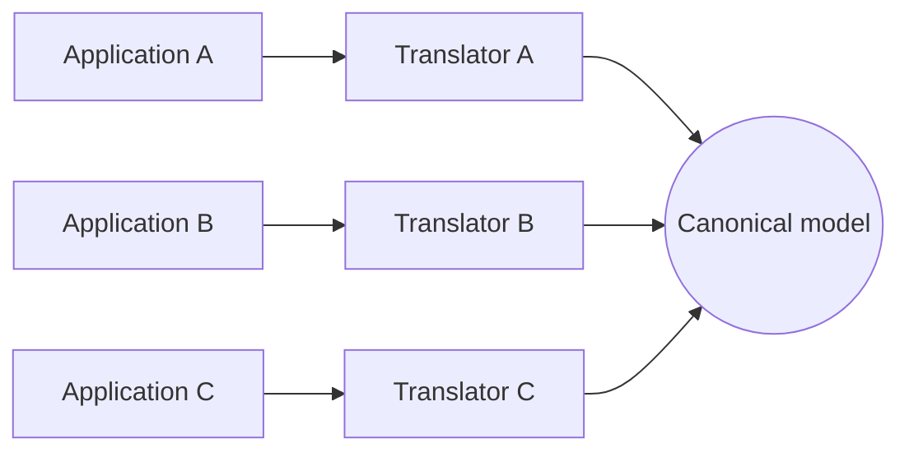

```mermaid
flowchart LR
    A["Application A"] --> TA["Translator A"]
    B["Application B"] --> TB["Translator B"]
    C["Application C"] --> TC["Translator C"]
    TA --> M(("Canonical model"))
    TB --> M
    TC --> M
```
