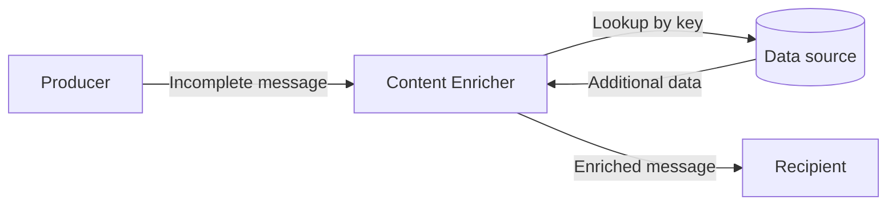

```mermaid
flowchart LR
    P["Producer"] -->|"Incomplete message"| E["Content Enricher"]
    E -->|"Lookup by key"| F[("Data source")]
    F -->|"Additional data"| E
    E -->|"Enriched message"| D["Recipient"]
```
