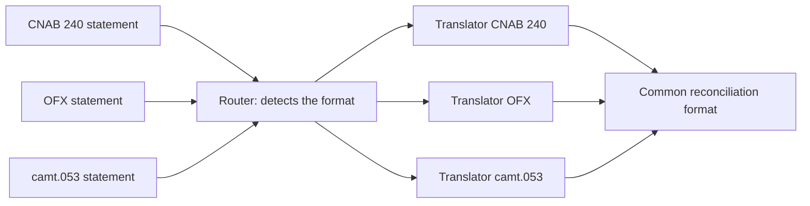

```mermaid
flowchart LR
    A["CNAB 240 statement"] --> R["Router: detects the format"]
    B["OFX statement"] --> R
    C["camt.053 statement"] --> R
    R --> T1["Translator CNAB 240"]
    R --> T2["Translator OFX"]
    R --> T3["Translator camt.053"]
    T1 --> N["Common reconciliation format"]
    T2 --> N
    T3 --> N
```
