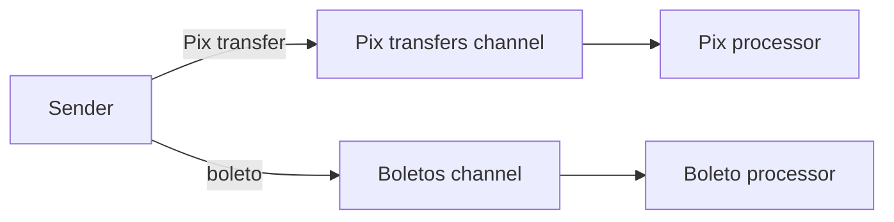

```mermaid
flowchart LR
    S["Sender"] -->|"Pix transfer"| C1["Pix transfers channel"]
    S -->|"boleto"| C2["Boletos channel"]
    C1 --> R1["Pix processor"]
    C2 --> R2["Boleto processor"]
```
