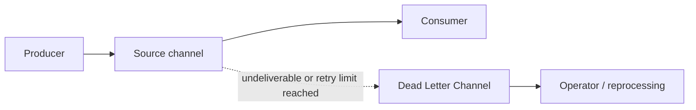

```mermaid
flowchart LR
    P["Producer"] --> C["Source channel"]
    C --> R["Consumer"]
    C -.->|"undeliverable or retry limit reached"| D["Dead Letter Channel"]
    D --> O["Operator / reprocessing"]
```
