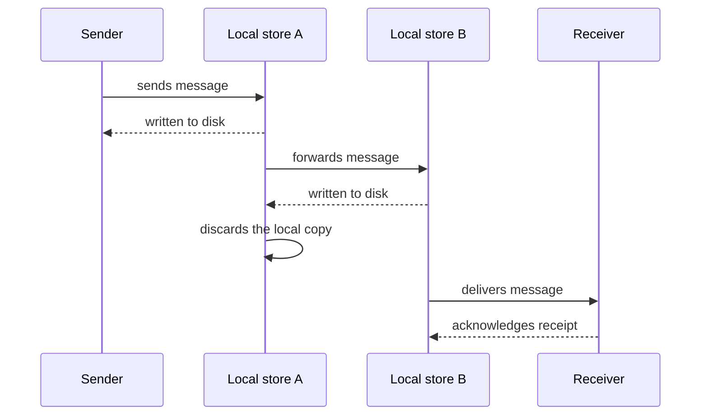

```mermaid
sequenceDiagram
    participant S as Sender
    participant M1 as Local store A
    participant M2 as Local store B
    participant R as Receiver
    S->>M1: sends message
    M1-->>S: written to disk
    M1->>M2: forwards message
    M2-->>M1: written to disk
    M1->>M1: discards the local copy
    M2->>R: delivers message
    R-->>M2: acknowledges receipt
```
