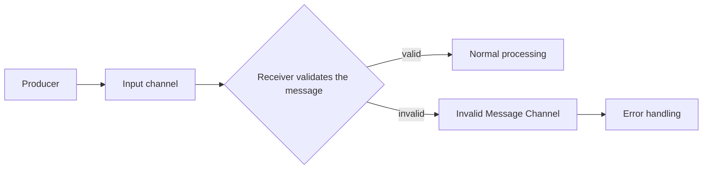

```mermaid
flowchart LR
    P["Producer"] --> C["Input channel"]
    C --> R{"Receiver validates the message"}
    R -->|"valid"| OK["Normal processing"]
    R -->|"invalid"| I["Invalid Message Channel"]
    I --> E["Error handling"]
```
