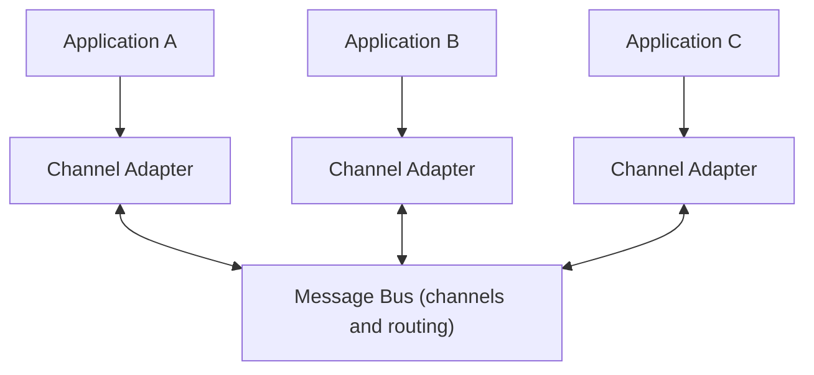

```mermaid
flowchart TD
    A1["Application A"] --> AD1["Channel Adapter"]
    A2["Application B"] --> AD2["Channel Adapter"]
    A3["Application C"] --> AD3["Channel Adapter"]
    AD1 <--> BUS["Message Bus (channels and routing)"]
    AD2 <--> BUS
    AD3 <--> BUS
```
