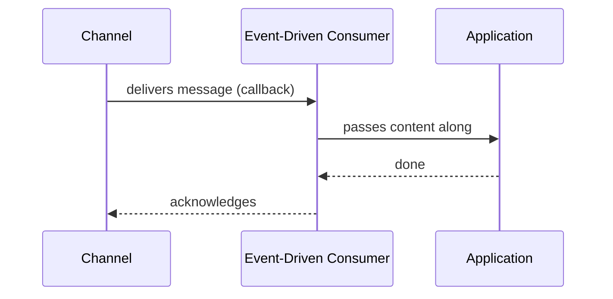

```mermaid
sequenceDiagram
    participant C as Channel
    participant E as Event-Driven Consumer
    participant A as Application
    C->>E: delivers message (callback)
    E->>A: passes content along
    A-->>E: done
    E-->>C: acknowledges
```
