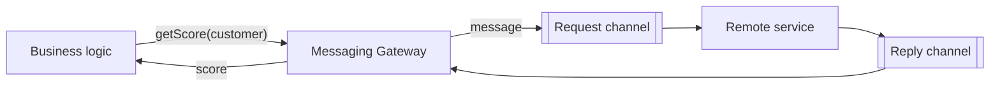

```mermaid
flowchart LR
    A["Business logic"] -->|"getScore(customer)"| G["Messaging Gateway"]
    G -->|"message"| C[["Request channel"]]
    C --> S["Remote service"]
    S --> R[["Reply channel"]]
    R --> G
    G -->|"score"| A
```
