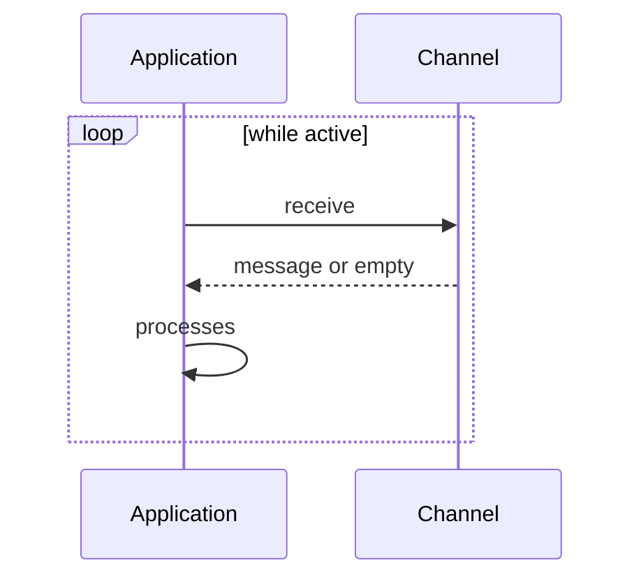

```mermaid
sequenceDiagram
    participant A as Application
    participant C as Channel
    loop while active
        A->>C: receive
        C-->>A: message or empty
        A->>A: processes
    end
```
