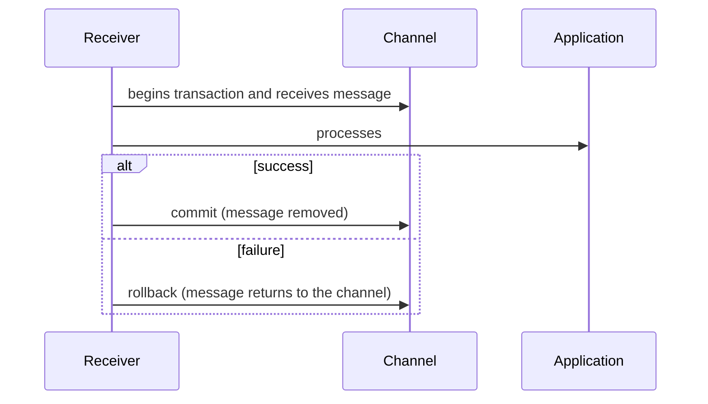

```mermaid
sequenceDiagram
    participant R as Receiver
    participant C as Channel
    participant S as Application
    R->>C: begins transaction and receives message
    R->>S: processes
    alt success
        R->>C: commit (message removed)
    else failure
        R->>C: rollback (message returns to the channel)
    end
```
