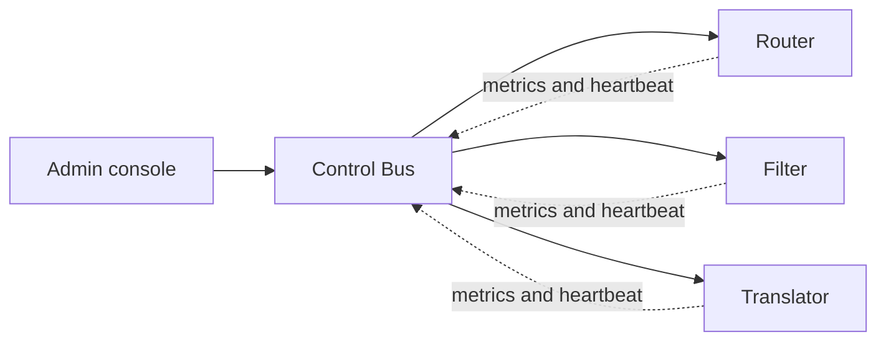

```mermaid
flowchart LR
    Admin["Admin console"] --> CB["Control Bus"]
    CB --> R["Router"]
    CB --> F["Filter"]
    CB --> T["Translator"]
    R -. "metrics and heartbeat" .-> CB
    F -. "metrics and heartbeat" .-> CB
    T -. "metrics and heartbeat" .-> CB
```
