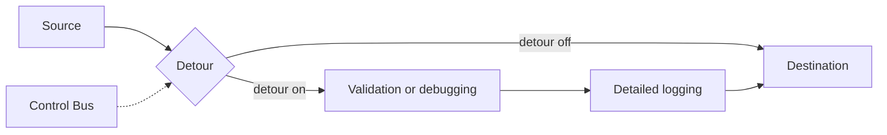

```mermaid
flowchart LR
    A["Source"] --> D{"Detour"}
    CB["Control Bus"] -.-> D
    D -- "detour off" --> Z["Destination"]
    D -- "detour on" --> S1["Validation or debugging"]
    S1 --> S2["Detailed logging"]
    S2 --> Z
```
