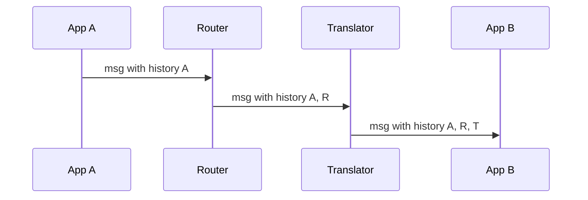

```mermaid
sequenceDiagram
    participant A as App A
    participant R as Router
    participant T as Translator
    participant B as App B
    A->>R: msg with history A
    R->>T: msg with history A, R
    T->>B: msg with history A, R, T
```
