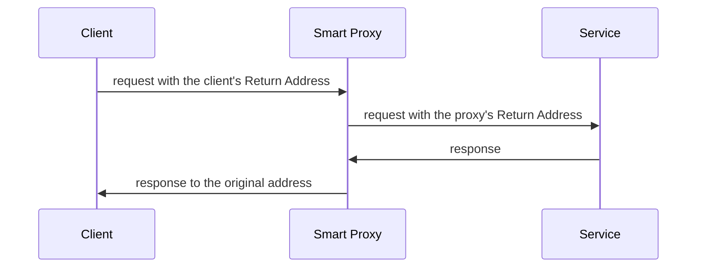

```mermaid
sequenceDiagram
    participant C as Client
    participant P as Smart Proxy
    participant S as Service
    C->>P: request with the client's Return Address
    P->>S: request with the proxy's Return Address
    S->>P: response
    P->>C: response to the original address
```
