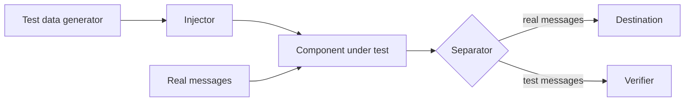

```mermaid
flowchart LR
    G["Test data generator"] --> I["Injector"]
    I --> C["Component under test"]
    A["Real messages"] --> C
    C --> S{"Separator"}
    S -- "real messages" --> D["Destination"]
    S -- "test messages" --> V["Verifier"]
```
