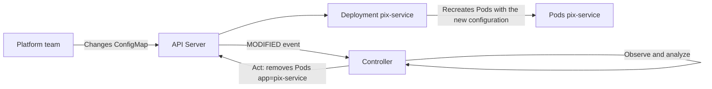

```mermaid
flowchart LR
    U["Platform team"] -->|"Changes ConfigMap"| API["API Server"]
    API -->|"MODIFIED event"| C["Controller"]
    C -->|"Observe and analyze"| C
    C -->|"Act: removes Pods app=pix-service"| API
    API --> D["Deployment pix-service"]
    D -->|"Recreates Pods with the new configuration"| P["Pods pix-service"]
```
