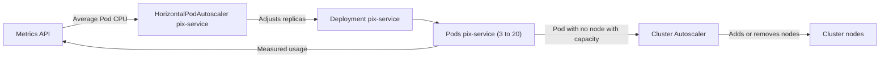

```mermaid
flowchart LR
    M["Metrics API"] -->|"Average Pod CPU"| HPA["HorizontalPodAutoscaler pix-service"]
    HPA -->|"Adjusts replicas"| D["Deployment pix-service"]
    D --> P["Pods pix-service (3 to 20)"]
    P -->|"Pod with no node with capacity"| CA["Cluster Autoscaler"]
    CA -->|"Adds or removes nodes"| N["Cluster nodes"]
    P -->|"Measured usage"| M
```
