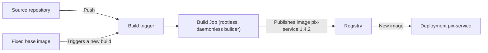

```mermaid
flowchart LR
    G["Source repository"] -->|"Push"| T["Build trigger"]
    T --> B["Build Job (rootless, daemonless builder)"]
    B -->|"Publishes image pix-service:1.4.2"| R["Registry"]
    R -->|"New image"| D["Deployment pix-service"]
    BI["Fixed base image"] -->|"Triggers a new build"| T
```
