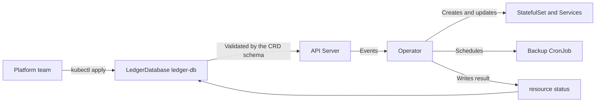

```mermaid
flowchart LR
    T["Platform team"] -->|"kubectl apply"| CR["LedgerDatabase ledger-db"]
    CR -->|"Validated by the CRD schema"| API["API Server"]
    API -->|"Events"| OP["Operator"]
    OP -->|"Creates and updates"| STS["StatefulSet and Services"]
    OP -->|"Schedules"| CJ["Backup CronJob"]
    OP -->|"Writes result"| ST["resource status"]
    ST --> CR
```
