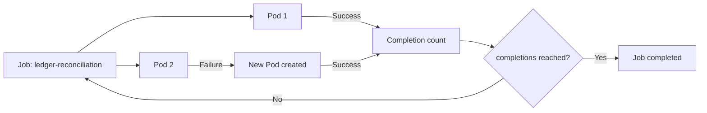

```mermaid
flowchart LR
    J["Job: ledger-reconciliation"] --> P1["Pod 1"]
    J --> P2["Pod 2"]
    P1 -->|"Success"| OK["Completion count"]
    P2 -->|"Failure"| R["New Pod created"]
    R -->|"Success"| OK
    OK --> D{"completions reached?"}
    D -->|"Yes"| F["Job completed"]
    D -->|"No"| J
```
